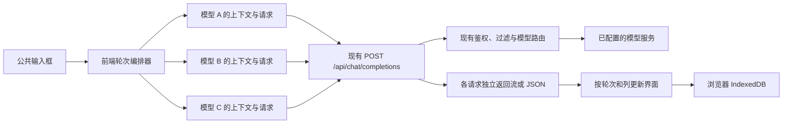

# 多模型对比：前端编排实现方案

日期：2026-09-22。分析依据：当前工作区代码，`package.json` 标记版本为 0.11.3，以及用户提供的页面截图。本文为实施方案，未实现功能、未调用真实模型、未验证生产环境。

## 1. 结论与范围

可以在不修改 Open WebUI 后端、模型路由、聊天数据库结构和主聊天消息树的前提下实现。

推荐新增独立 `/compare` 页面，复用现有登录态、模型列表、单模型补全 API、Markdown 和公共控件；前端负责把一次输入并发分发给多个模型、维护各列上下文、接收流式响应和保存本地历史。

需求中的“前端实现”指编排发生在浏览器。模型请求仍发送到现有 Open WebUI 后端，由后端连接模型服务；浏览器不直接保存供应商密钥或调用供应商。

方案暂按以下产品假设设计，均为建议而非截图已经确定的业务规则：

- 第一版支持选择 2～3 个不同模型；不固定截图中的模型名称。
- 同一轮共享用户输入，各模型独立累积自己的历史回答。
- 对比记录保存在当前浏览器，不进入普通聊天列表，不支持跨设备同步。
- 第一版提供文本对话、流式显示、停止、最新一轮单列重试、复制、本地会话管理。
- 文件、知识库、联网、工具调用、语音、自动评分和正式聊天导入作为后续能力单独设计。

截图中的“资格快照”“模型广场”等文字仅为参考。当前核查的接口不足以证明存在相应业务机制，不能把这些文案直接实现为既有能力承诺。

## 2. 已有能力与代码依据

| 能力 | 当前实现证据 | 对方案的影响 |
| --- | --- | --- |
| 原生多模型选择 | `src/lib/components/chat/ModelSelector.svelte:82` | 已有 `chat.multiple_models` 前端权限语义和模型选择控件可参考 |
| 原生多模型发送 | `src/lib/components/chat/Chat.svelte:3331` | 当前版本通过一次请求让后端分发多个模型；不是前端独立请求的实现 |
| 并排回答 | `src/lib/components/chat/Messages/MultiResponseMessages.svelte` | 绑定 `history` 消息树、主聊天更新、分支切换和合并回答，不适合作为独立列会话容器直接套用 |
| 简单单模型调用 | `src/lib/components/playground/Chat.svelte:89` | 已使用完整 `messages` 请求现有补全 API，可作为调用方式的直接参考 |
| 请求封装 | `src/lib/apis/openai/index.ts:392` | `chatCompletion()` 调用 `/api/chat/completions`，但当前控制器在 fetch 返回后才交给调用者 |
| 流式基础设施 | `src/lib/apis/streaming/index.ts:28` | 已有 `eventsource-parser`；当前文本适配器不完整保留 reasoning、结束原因等信息 |
| 后端鉴权与模型访问 | `backend/open_webui/main.py:1087` | 每个请求继续复用现有登录校验和模型访问检查 |
| 新聊天创建条件 | `backend/open_webui/main.py:1190` | 显式提供 `parent_id: null` 且无 `chat_id` 会表示创建聊天，独立对比请求不应携带该字段 |
| 单模型直接返回路径 | `backend/open_webui/main.py:1856` | 没有会话分发元数据时，现有接口可直接返回单模型结果 |
| 非流式兼容要求 | `backend/open_webui/main.py:1170` | 模型配置可能覆盖 `stream`，前端即使请求流式，也需要接受 JSON 返回 |
| Markdown 与公共控件 | `chat/Messages/Markdown.svelte`、`components/common` | 复用既有富文本、弹窗、提示、选择器和加载组件 |

上述行号对应分析时的工作区，后续上游升级时应重新核对接口行为。

## 3. 候选实现方式

| 方案 | 优点 | 代价 / 适配程度 |
| --- | --- | --- |
| 直接使用原生多模型聊天 | 开发量最少，完整复用主聊天功能 | 适合“同一聊天里的多答案”；当前发送由后端分发，历史和分支语义与截图不完全一致 |
| 在主 Chat 中增加对比模式 | 可以共用较多聊天能力 | 要处理全局 chatId、消息树、保存、事件、队列等耦合，容易扩大改动范围 |
| 独立对比页 + 现有单模型 API | 前端独立分发、独立上下文、独立本地记录，接触上游代码少 | 需要编写小型编排器及会话状态管理；推荐 |

如果实际目标只是“一个问题同时看多个答案”，原生功能值得先试用。如果要求截图这种完整的多列调试工作台，则选择独立对比页更合适。

不建议渲染三份完整 `Chat.svelte`，也不建议用 iframe 包装三个聊天页面；这些做法会带入各自的全局状态、输入框、事件订阅和保存行为。

## 4. 页面与交互

- 左侧：本地对比会话列表、新建、删除。与 Open WebUI 普通聊天记录明确区分。
- 顶部：对比标题、模型组合、清空当前会话。
- 中间：2～3 列等宽卡片；每列固定展示模型名称、生成状态、停止/重试和复制操作。
- 底部：公共输入框；Enter 发送，Shift+Enter 换行；中文输入法组词期间 Enter 不发送。
- 每列独立滚动，只在用户停留在底部时自动跟随；向上阅读时保持位置。第一版不做像素级同步滚动。
- 宽屏并排；中屏允许横向滚动并保留可读列宽；窄屏切换模型标签查看，后台请求状态继续更新。
- 请求中允许编辑下一条草稿，但当前轮次未结束前禁止再次提交。第一版不引入消息队列。
- 使用现有应用主题、i18next、提示和确认弹窗；截图作为布局参考，不强制普通聊天界面同步改版。

入口建议放在登录后的普通应用中。当前 Sidebar 的 Playground 入口仅对管理员展示，因此不要单纯把对比功能藏在 Playground 下。新入口和路由守卫沿用管理员或 `chat.multiple_models` 的可见性语义，模型能否调用仍由既有后端决定。

## 5. 调用架构与 API 契约



每列请求的最小载荷：

```json
{
  "model": "来自服务端模型列表的真实模型 ID",
  "stream": true,
  "messages": [
    { "role": "system", "content": "可选的统一系统提示词" },
    { "role": "user", "content": "第一轮问题" },
    { "role": "assistant", "content": "当前列模型的第一轮回答" },
    { "role": "user", "content": "第二轮问题" }
  ]
}
```

没有设置系统提示词时，省略该条消息。第一版默认使用服务端模型参数，不自动复制个人主聊天设置；如提供统一参数面板，只发送经过支持性确认的字段。

关键约束：

1. 只调用现有 Open WebUI 同源 API，沿用用户认证方式。
2. 使用服务端返回的模型列表。`getModels()` 可以合并用户浏览器直连模型；此页面应使用服务端列表来源，例如 `getModels(token, null)`，避免把 `direct: true` 模型混进同一调用假设。
3. 对比会话 ID、轮次 ID 和列 ID 仅为前端内部标识，不作为正式聊天 ID 发送。
4. 不发送 `parent_id`、`chat_id`、`session_id`、`message_ids`、`user_message` 或聊天后台任务字段，以保持简单单模型 API 的调用语义。
5. 不调用 `createNewChat`、`updateChatById`、标题生成和主聊天完成回调；列表标题从第一条输入本地生成。
6. 每列只发送自己的上下文，不从主 Chat 的共享消息树构造请求。

并发逻辑使用 `Promise.allSettled()` 收集结果，实际内容在各自的异步流循环内即时更新。一列失败只改变该列的状态，不取消其它列，不等待所有列完成后才显示答案。

“同时发送”表示前端并发发起，服务端队列和上游资源仍可能导致串行处理。N 个模型通常对应 N 个独立生成请求，实际费用取决于各模型和输入输出长度，不承诺固定倍数。

## 6. 多轮上下文与可比性

默认采用独立对话模式：

```text
模型 A：系统提示词 → 问题 1 → A 回答 1 → 问题 2
模型 B：系统提示词 → 问题 1 → B 回答 1 → 问题 2
模型 C：系统提示词 → 问题 1 → C 回答 1 → 问题 2
```

这是对比不同模型各自的连续对话体验；第二轮开始，各列历史并不完全一致。因此它不等价于严格控制所有输入变量的评测。

若后续需要更严格的评测，可增加“单轮模式”：每次只发送相同系统提示词与当轮用户输入。第一版不同时实现多种复杂的上下文策略。

其它规则：

- 首次发送后固定模型组合和系统提示词；更换模型或提示词创建新会话。
- 每轮保存请求参数快照，避免生成过程中修改设置影响重试语义。
- 模型自带的系统提示词、服务端参数、过滤器、知识配置或路由回退可能产生差异。前端只能保证提交的输入规则一致，不能保证最终上游请求完全一致。
- 第一版优先选择普通文本聊天模型；Arena、Pipe 或依赖工具事件的定制模型在完成兼容性验证前不宣称支持。
- 长对话先采用明确的历史上限与超限提示；如需要裁剪，以完整轮次裁剪并显示规则，不偷偷丢弃历史，不额外调用模型做摘要。

## 7. 状态、取消、重试和异常

每次请求状态建议为：

```text
idle → requesting → streaming → completed
                  ↘ failed / cancelled / interrupted
```

`requesting` 表示等待响应，`streaming` 表示已经收到内容；`interrupted` 用于断网、刷新后恢复或意外断流，不能展示为成功完成。

### 7.1 唯一标识与并发保护

以 `sessionId + roundId + laneId + attemptId` 定位一次生成，不能只以模型 ID 定位。每次重试生成新 `attemptId`，只接收当前有效尝试的回调。

清空、删除、切换会话和离开页面时，先使当前请求代次失效，再取消请求；旧数据包、旧异步存储操作不得写入已切换或已删除的会话。后台持续生成不属于第一版范围。

### 7.2 停止

每列有独立 `AbortController`，另有“全部停止”。控制器必须在开始 fetch 前登记。

当前 `chatCompletion()` 是在 fetch 返回后才返回控制器，无法让调用方可靠取消等待响应头的请求。推荐给该前端 helper 增加可选的外部 controller 参数，原调用签名保持兼容；也可在明确无法扩展时使用本功能的薄请求适配器。无需修改后端。

取消时保留已生成内容，并标记“不完整”。浏览器断开请求不等于上游已经停止推理或停止计费，实际传播行为需要联调验证。

### 7.3 失败与继续下一轮

- 成功列保留；失败列显示可操作的错误提示，允许重试。
- 只支持最新一轮的单列重试，复用该次的输入和历史快照，不重复追加用户消息，不重跑成功列。
- 全部活动列成功后正常发送下一轮。
- 如果存在失败、取消或中断列，用户先重试，或明确暂停该列在后续轮次中的参与；不能无提示地丢掉失败轮次继续。
- 暂停列保留原记录和“未参与后续轮次”标记；第一版不在同一会话中自动补齐并重新加入，需新建会话。
- 不允许在已有后续轮次时重写早期回答；历史分支功能后续再设计。
- 不自动重发超时或已输出部分内容的生成请求，避免重复生成和额外费用。

### 7.4 流式协议

复用项目已安装的 `EventSourceParserStream` 进行 SSE 分帧，新增对比页适配器处理内容、reasoning（若返回）、usage、结束原因及 error。不要按网络 chunk 直接 JSON.parse，也不要复制 Playground 中简单按换行拼接的逻辑。

现有 `createOpenAITextStream()` 是可参考的基础，但它目前主要输出 `delta.content`；遇到 usage 后会 continue，且将流 EOF 当作 done。要支持本方案的完整状态，应以底层 parser 适配事件，或在保持既有调用兼容的前提下扩展该 helper。

适配器至少处理：

- 跨 chunk UTF-8 和 SSE 帧、空事件、终止标记、`finish_reason`。
- 同一事件包含 usage 与正文时两者都处理。
- 流中错误与非 2xx HTTP 错误；错误体兼容 JSON 和文本，不假定总有 `detail`。
- 无有效完成信号而意外断开时标记中断，保留部分内容。
- 返回 JSON 的非流式模型；按实际 Content-Type 分流。
- 上游省略 usage 时显示“未提供”，不根据字符数伪造 Token 数。
- 不支持的响应协议显示明确错误，不静默出现空白答案。

可记录客户端首内容耗时和总耗时，注明包含网络与服务端排队。流式显示不加入人工打字延迟，避免影响观测。

## 8. 前端数据结构

使用“共享轮次 + 按列回答”作为唯一存储事实，发送时派生各列 `messages`；不同时维护三套历史和一套公共历史。

```ts
type CompareSession = {
  schemaVersion: 1;
  id: string;
  ownerId: string;
  title: string;
  createdAt: number;
  updatedAt: number;
  systemPrompt: string;
  lanes: Array<{
    id: string;
    modelId: string;
    modelName: string;
    pausedFromRoundId?: string;
  }>;
  rounds: CompareRound[];
};

type CompareRound = {
  id: string;
  prompt: string;
  createdAt: number;
  participantLaneIds: string[];
  responses: Record<string, {
    attemptId: string;
    status: 'requesting' | 'streaming' | 'completed'
      | 'failed' | 'cancelled' | 'interrupted';
    content: string;
    reasoning?: string;
    error?: { message: string; code?: string };
    finishReason?: string;
    usage?: Record<string, unknown>;
    firstContentMs?: number;
    durationMs?: number;
    requestSnapshot: {
      modelId: string;
      messages: Array<{ role: string; content: string }>;
      params?: Record<string, unknown>;
    };
  }>;
};
```

`responses` 以 laneId 为 key。请求快照第一版只需保留最新可重试轮次的完整 messages，旧轮次保留参数和上下文来源索引，避免 O(轮次²) 的历史存储膨胀。上面类型展示语义，不要求所有快照永久重复保存。

运行时另维护 controller、计时器、reader 和请求代次，不序列化这些对象，也不把 token 写入会话数据。

## 9. 本地持久化与隐私文案

优先使用现有 `idb` 依赖，新建独立的对比会话数据库，不复用或修改历史 `Chats` 数据库。

- 按后端实例标识、用户 ID 和会话 ID 分区。浏览器 origin 自带站点隔离；同一 origin 切换后端时仍要区分实例。
- IndexedDB 仅在浏览器生命周期内初始化，避免 SSR 导入时访问浏览器 API。
- 流式更新节流落盘，例如 500～1000ms 一次；每次结束、停止或失败立即保存。
- 页面恢复时把遗留 requesting/streaming 状态改为 interrupted，不自动续发请求。
- 存储不可用、配额不足或写入失败时继续内存会话，显示“未保存到本地”；不能伪装为保存成功。
- 账号变化时停止活动请求并清空内存视图，只查询当前账号分区。本地分区只是应用层隔离，不等于设备级加密。
- 默认历史保留至用户删除；离职/退出即清除等企业保留策略若有要求，应在实现前明确。
- 同一会话第一版限定一个标签页写入，其它标签页只读；可使用浏览器锁或存储版本检测，避免旧快照互相覆盖。

推荐文案：

> 对比历史保存在当前浏览器，不同步到 Open WebUI 聊天列表。发送内容仍会经过服务器并传给所选模型服务。

不要使用“内容不会上传服务器”或“服务端完全不留存”。不创建聊天记录不能排除现有日志、过滤器、审计或供应商保留行为；具体策略取决于当前部署。

## 10. 文件与复用边界

建议新增：

```text
src/routes/(app)/compare/+page.svelte
src/lib/components/compare/CompareWorkspace.svelte
src/lib/components/compare/CompareHistory.svelte
src/lib/components/compare/CompareColumn.svelte
src/lib/components/compare/CompareComposer.svelte
src/lib/compare/types.ts
src/lib/compare/controller.ts
src/lib/compare/context.ts
src/lib/compare/stream.ts
src/lib/compare/storage.ts
```

各模块只解决本功能：`controller` 负责轮次、并发和取消；`context` 负责各列上下文；`stream` 负责协议事件归一化；`storage` 负责本地记录。无需增加通用工作流引擎。

预计修改接触点：

- `src/lib/components/layout/Sidebar.svelte`：入口及可见性。
- `src/lib/apis/openai/index.ts`：可选外部 controller，保持原调用兼容。
- 必要的中英文 i18n 词条。
- 如入口受独立导航配置管理，同步相应导航配置。

复用规则：

- Markdown 使用现有渲染链及其 HTML 清理，关闭对比页不提供的代码编辑、保存与交互嵌入操作。
- 选择器复用现有通用搜索/选择控件，模型数据源使用已筛选的服务端列表；不要无条件套用读取全局混合模型列表并保存个人默认设置的高层组件。
- 复用应用的 Modal / ConfirmDialog / Tooltip / Spinner / toast；输入组件仅在满足键盘事件与 IME 需求时直接复用，否则做小幅兼容扩展。
- 对比状态由功能实例持有，不复用主聊天的全局 chatId、history、temporaryChatEnabled 或 WebSocket 完成回调。
- 不新增 npm 依赖，不改后端 Python、数据库 migration、供应商适配器或主聊天控制流。

## 11. 分阶段实施

| 阶段 | 交付物 | 粗估工作量 |
| --- | --- | --- |
| 接口验证 | 验证两个真实模型、SSE/JSON、错误返回、取消和无正式聊天写入 | 0.5～1 人日 |
| 核心对比 | 独立页面、模型选择、前端并发、独立上下文、停止和流式状态 | 1.5～2 人日 |
| 可用性与历史 | 本地会话、最新轮次重试、滚动、移动端与账号恢复 | 1.5～2 人日 |
| 验收与兼容 | 异常模拟、实际模型联调、已有聊天回归和构建检查 | 1～2 人日 |

合计约 4.5～7 人日，按熟悉该仓库的单名前端开发估算，不含新后端能力、企业保留政策决策或供应商异常排查。仅演示三列并发会更快，但不能替代上面列出的取消、错误和历史行为。

后续再考虑：单轮评测模式、参数对比、Markdown/JSON 导出、同步定位到同一轮、人工评分。文件/RAG/工具及导入正式聊天需要额外验证现有协议，不能因普通文本调用可用就默认等价支持。

## 12. 验收标准

1. 一次提交向 N 个选定模型发出 N 个现有补全请求；没有新增接口，也没有创建/更新普通聊天的请求。
2. 两轮请求抓包确认：A 的 messages 只含 A 的回答，B/C 同理；同一轮用户输入一致。
3. 请求等待响应头时可停止；单列停止不影响其它列；全部停止后没有旧回调污染下一会话。
4. 模拟一列错误、超时或中途断流，其它列继续，已显示内容保留；重试只重发当前失败列且不重复用户消息。
5. 验证 SSE 跨块分帧、正文和 usage 同帧、无 usage、流中错误、完成标志及非流式 JSON。
6. 刷新恢复本地记录，中断状态诚实呈现；删除后旧异步写入不能使记录复活；存储失败有明确提示。
7. 切换账号、模型下架/权限变化和同会话多标签页写入得到可预期处理。
8. 中文输入法 Enter、Shift+Enter、键盘操作、长代码块、独立滚动、窄屏和现有主题可用。
9. 现有单模型和原生多模型聊天不受影响；对可选 controller 的前端 API 改动进行兼容性回归。
10. 运行相关 Vitest 用例、项目类型检查和生产构建；如仓库已有历史诊断，单独说明基线与新增诊断，不能把全局检查失败说成通过。

优先为上下文隔离、重复提交保护、取消/旧回调、重试语义和流解析写有意义的测试；纯布局与颜色调整使用浏览器验证。

当前验证边界：已完成代码静态分析。上述接口联调、浏览器验证和测试均为实施阶段的验收要求，并未在本轮执行。
